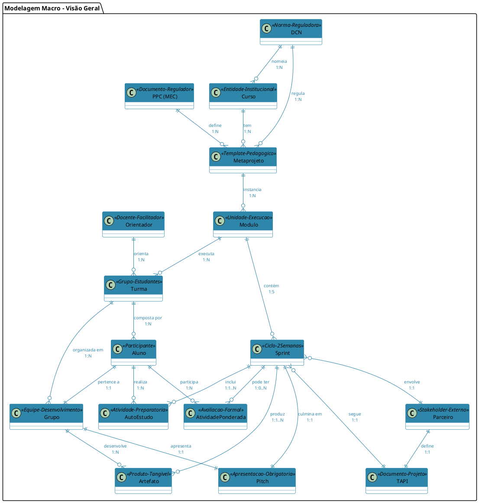
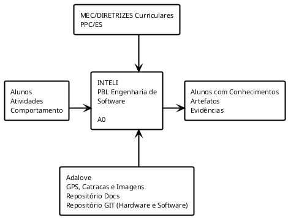
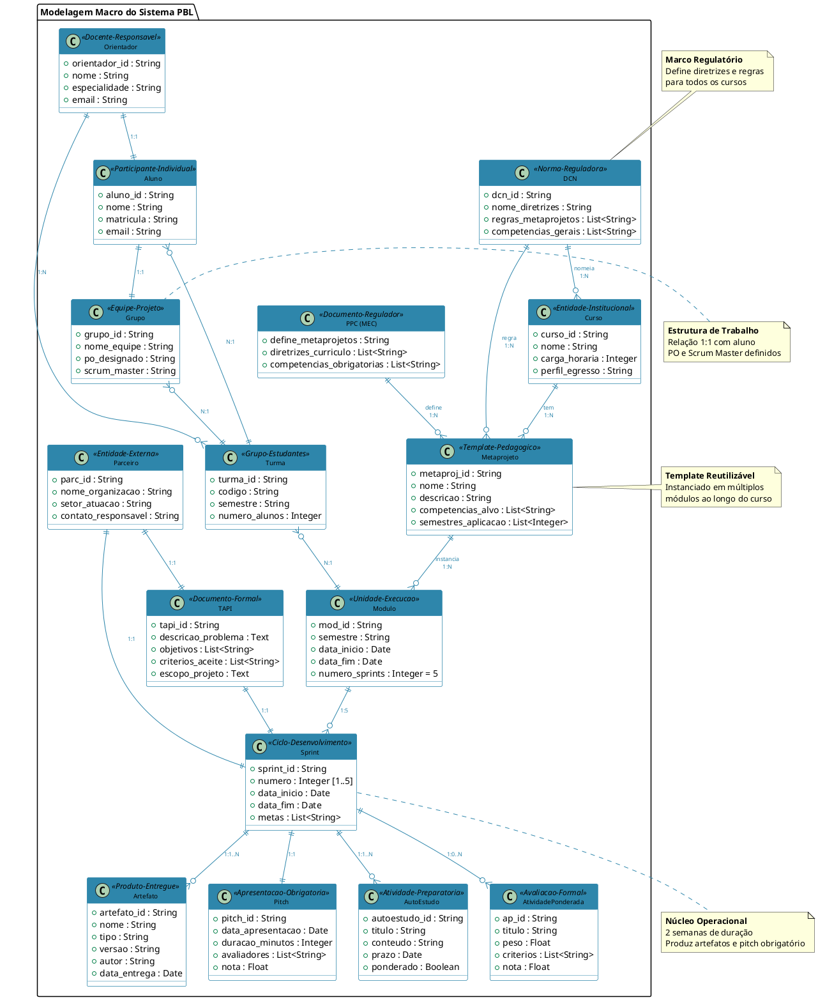
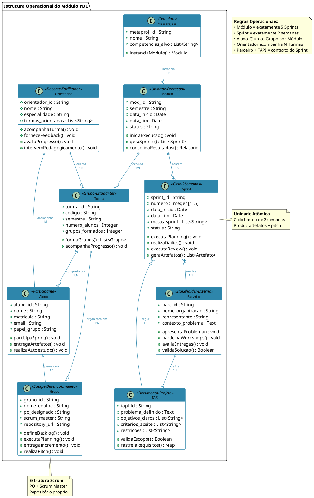
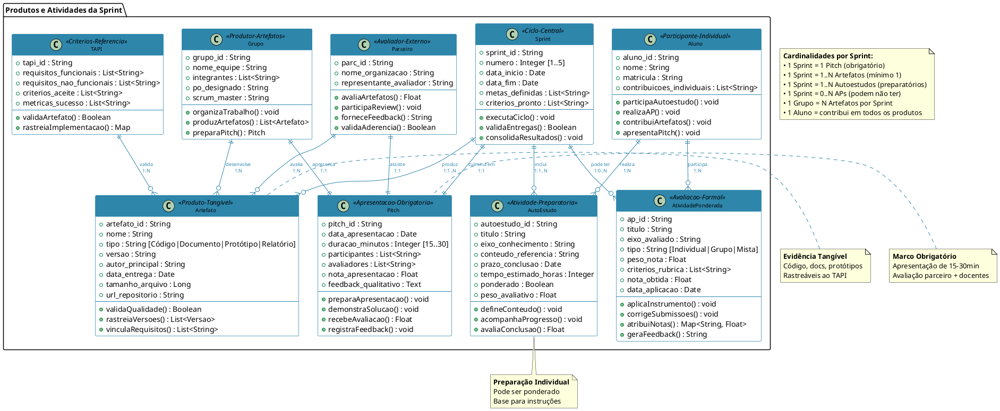
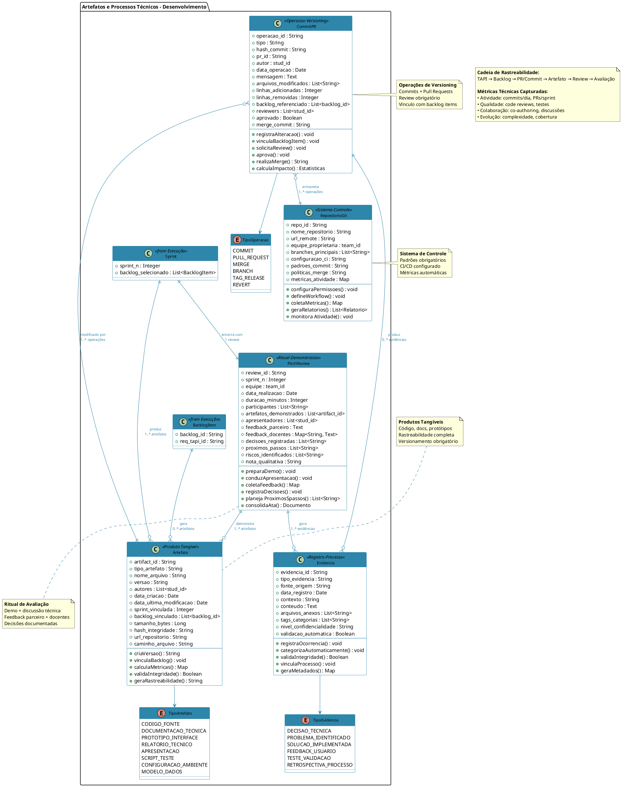
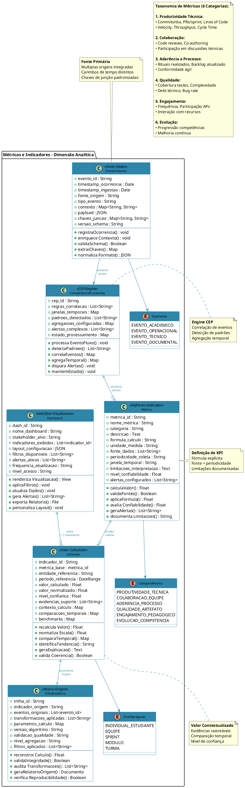
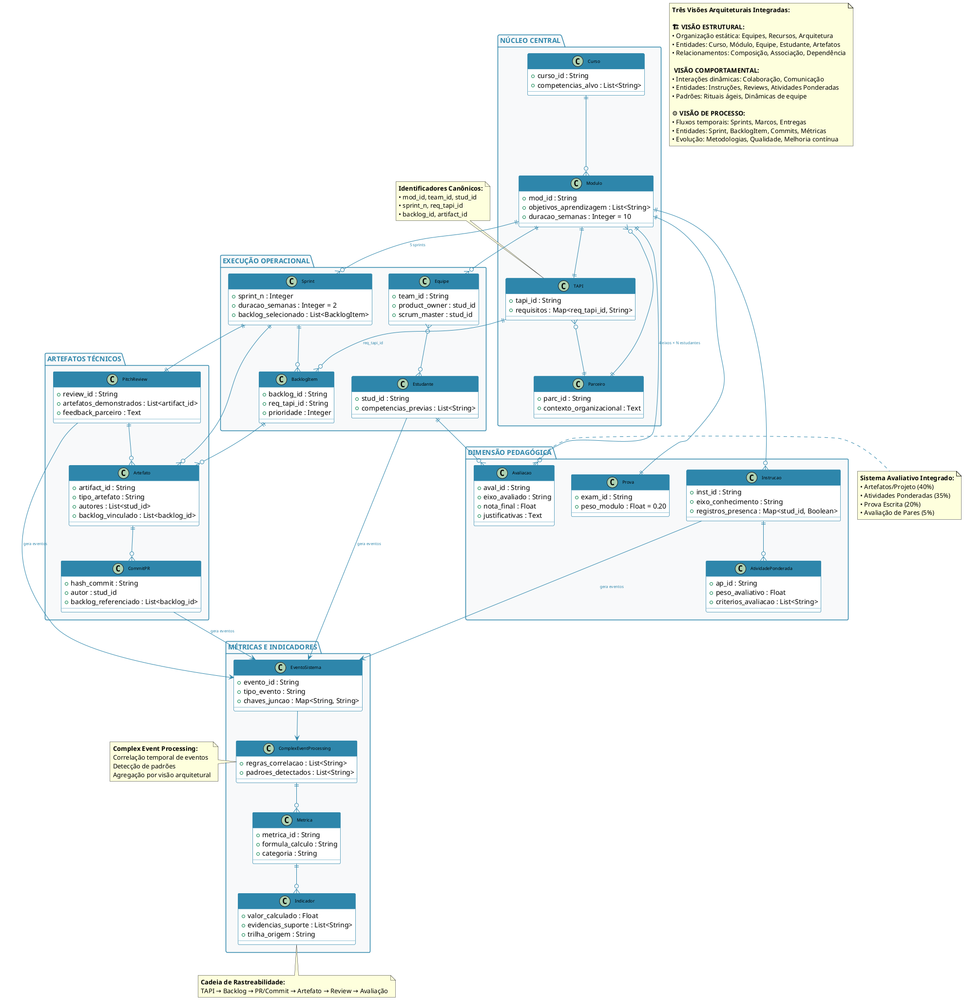

Article information

Article title
A Conceptual Model of a Digital Twin for Project-Based Learning Assessment in Software Engineering

Authors
Author One¹, Author Two²*

Affiliations
¹Department, University, City, Country
²Department, University, City, Country

Corresponding author’s email address and Twitter handle
*author.two@example.com

Keywords
Digital Twin; Project-Based Learning; PBL; Software Engineering Education; Conceptual Model; Learning Analytics

Related research article
None

Abstract
This article presents a conceptual model for a digital twin designed for the assessment of Project-Based Learning (PBL) projects in software engineering. The model integrates three architectural views (structural, behavioral, and process) in accordance with ISO/IEC/IEEE 42010:2022, enabling continuous and holistic monitoring of the learning process. The digital twin operates by ingesting and processing a wide range of academic and operational events to generate formative feedback, performance indicators, and traceable justifications for students, faculty, and coordinators. By creating a high-fidelity virtual representation of the educational process, the model aims to enhance transparency, facilitate personalized feedback, and improve the overall effectiveness and reproducibility of PBL assessment.

Graphical abstract

Specifications table
| Subject area | Social Sciences |
| :--- | :--- |
| More specific subject area | Education, Software Engineering, Learning Analytics, Instructional Design |
| Name of your method | Digital Twin Conceptual Model for PBL Assessment |
| Name and reference of original method | The model is based on the principles of architectural description from ISO/IEC/IEEE 42010:2022, Systems and software engineering — Architecture description. |
| Resource availability | N/A |

Background
The method described herein is designed for a Project-Based Learning (PBL) environment within a Software Engineering undergraduate program. The pedagogical structure consists of quarterly modules where students tackle authentic problems proposed by external industry partners. Each module spans ten weeks and is organized into five two-week sprints, emulating a professional agile development cycle.

The foundational document for each module is the Institutional Project Opening Agreement (TAPI), which formally outlines the problem statement, learning objectives, project scope, and evaluation criteria. This document serves as a contract and a single source of truth for all stakeholders. The educational process adopts the Scrum framework, wherein student teams self-organize by designating Product Owner and Scrum Master roles. They conduct standard agile ceremonies, including sprint planning, daily stand-ups, and sprint reviews, the latter of which involves mandatory participation from the external partner and faculty members to provide feedback on the developed increments.

The learning experience is supported by a diverse team of educators, including a primary mentoring professor, alongside specialized instructors for programming, UX/UI design, business, and leadership. This is complemented by a structured self-study curriculum designed to provide the necessary theoretical foundation for the practical work undertaken in the sprints.

Assessment is a composite, multi-faceted process. The final grade for a module is calculated from four distinct components: Artifacts and Project Deliverables (40%), Graded Activities (35%), a comprehensive final Exam (20%), and a Peer Assessment (5%). A key feature of this model is the active involvement of the external partner, who provides critical qualitative evaluations of project deliverables during the sprint reviews. To synthesize these diverse inputs, the model employs Complex Event Processing (CEP) to aggregate and correlate events from multiple sources—such as Git repositories, task management boards, academic information systems, and institutional access-control sensors—deriving integrated metrics that inform the three core architectural views of the model.

Method details

### Processes and Abstractions (IDEF0)

To ensure a clear and rigorous definition, the model is structured using the IDEF0 (Integration Definition for Function Modeling) methodology. This approach provides a hierarchical decomposition of processes, allowing for a top-down analysis from a systemic overview to granular operational details.

**Abstraction Layer 0 - Systemic View:** At the highest level of abstraction, Layer 0 portrays the entire PBL system as a single, cohesive function. This function is governed by external controls, namely the national curriculum guidelines and institutional policies. It processes a set of inputs—students, their behaviors, and assigned activities—using a variety of technological mechanisms, including academic systems, code repositories, and physical sensors. The resulting outputs are students equipped with demonstrable knowledge, tangible project artifacts, and a body of evidence documenting their learning journey.

### Modeling: Entities and Relationships

The conceptual model is defined by a set of core entities and their relationships, organized within a macro-hierarchical structure. This design ensures that every operational activity, such as a single code commit, can be traced back to overarching institutional and regulatory frameworks, providing a clear line of sight between execution and strategy.

**Overall Macro Model:** The architecture is built upon a primary hierarchical chain: **DCN → Course → Metaproject → Module → Sprint**. This structure governs the pedagogical and administrative aspects of the program. It is interconnected with a set of operational entities (Class, Student, Group), contextual elements (Partner, TAPI), and the products of student work (Artifacts, Pitch, Self-studies, Graded Activities), forming a comprehensive and interconnected ecosystem.

#### Institutional Hierarchy

The model's foundation rests on a hierarchical structure that ensures alignment with national educational standards while providing a clear framework for execution. This top-down approach guarantees that pedagogical activities are not only effective but also compliant with the regulatory landscape.

At the apex are the **National Curriculum Guidelines (DCN)**, which establish the regulatory framework for all **Courses** and define the rules for creating **Metaprojects**. Each **Course** within the institution implements multiple Metaprojects, which serve as reusable pedagogical templates defining target competencies, curriculum structure, and methodologies. These Metaprojects are then instantiated as concrete **Modules**. Each Module represents a specific 10-week, 5-sprint learning engagement. The context for each module is established by the **Partner-TAPI-Sprint** triad, a 1:1:1 relationship ensuring that each development cycle is grounded in a real-world problem (**Partner**), guided by a formal scope document (**TAPI**), and executed through incremental development (**Sprint**).

#### Operational Structure

The operational layer of the model defines how students and faculty are organized to execute the work within a module.

A **Module** is composed of exactly five **Sprints** and is delivered to one or more **Classes**. Each **Class** is a cohort of **Students**, who are organized into small **Groups** (or teams) in a stable 1:1 student-to-group relationship for the duration of the module. A dedicated **Mentor** (faculty member) is assigned to guide multiple classes, and they maintain a specific 1:1 relationship with a designated student from each for individualized coaching and follow-up.

#### Sprint Products

Each two-week sprint is designed to produce a well-defined set of outputs, creating a consistent rhythm of delivery and assessment.

Every **Sprint** mandatorily produces: one or more **Artifacts** (e.g., source code, documentation, prototypes), exactly one **Pitch** (a 15-30 minute presentation of the increment), one or more **Self-studies** (preparatory or graded theoretical work), and zero or more **Graded Activities** (formal assessments). The **Groups** are responsible for collectively developing the Artifacts and delivering the Pitch, while **Students** are individually responsible for completing Self-studies and participating in Graded Activities. The external **Partner** plays a crucial role in evaluating these products against the criteria established in the **TAPI**.

#### Technical Artifacts and Processes

The model ensures full traceability within the technical development process, linking high-level requirements to the code itself.

The **Artifact** entity represents any tangible output from the student teams. The **Pitch/Review** ceremony serves as a formal, incremental evaluation ritual at the conclusion of each sprint, where artifacts are demonstrated and discussed. The final **Assessment** is a consolidation of grades from multiple sources, reflecting the weighted contribution of artifacts, graded activities, a final exam, and peer evaluations.

#### Metrics and Indicators

The analytical power of the model comes from its ability to transform raw event data into meaningful, contextualized indicators.

The model's analytical engine leverages **Complex Event Processing (CEP)** to dynamically analyze and correlate high-volume event streams from disparate sources in real-time. This allows the system to move beyond simple metrics and detect meaningful patterns, such as a decline in commit frequency after a critical feedback session, or a correlation between student engagement in preparatory materials and the quality of sprint artifacts. Each **Metric** is a defined indicator that operationalizes a specific learning objective or TAPI criterion, serving as a basis for continuous feedback and objective comparison across sprints, teams, and modules.

#### Complete Integrated Model

The consolidated view of the model integrates all previously described dimensions, providing a holistic framework that supports the three architectural views required by ISO/IEC/IEEE 42010:2022.

This integrated structure establishes a robust set of relationships and constraints that ensure the architectural coherence and integrity of the pedagogical process. The cornerstone of the model is the unchangeable link between a Module, its Partner, and its TAPI, creating an unbreakable bond between the academic environment and a real-world professional context. The rigid 10-week timeline, divided into five 2-week sprints, enforces a sustainable rhythm of learning and development. Ultimate traceability is achieved by systematically linking every artifact back to a backlog item and, in turn, to a specific requirement in the TAPI, making the entire learning and development process transparent and auditable.

### Conceptual Framework

The model is built upon a set of core assumptions, actors, events, and requirements.

*   **Assumptions**: Its successful implementation presupposes an institutional commitment to agile practices, the use of a structured TAPI for all projects, and the availability of integrated digital infrastructure, including code repositories and task management tools.
*   **Actors**: The primary actors are the **Students** and their **Teams**, the **Mentoring Professor**, specialized **Subject Matter Experts**, the **External Partner**, and the program **Coordination**.
*   **Events**: Events are the raw data that fuel the digital twin. They are classified into four types: **Academic** (e.g., lecture attendance), **Operational** (e.g., sprint planning meetings), **Technical** (e.g., code commits, pull requests), and **Documentary** (e.g., TAPI updates).
*   **Identifiers**: A system of canonical identifiers (e.g., `course_id`, `module_id`, `student_id`) is employed to ensure data integrity and enable complete traceability across all integrated systems.
*   **System Requirements**: The model demands high levels of **Reliability**, near real-time **Latency** (daily updates), **Scalability** to handle concurrent modules, robust **Security**, and high **Usability** through role-based dashboards.

### Implementation Architecture

The model's architecture is multi-dimensional and layered to separate concerns and facilitate implementation.

*   **Dimensions**: It integrates four key dimensions: the **Pedagogical** (learning activities and competencies), the **External Partnership** (real-world context), the **Technical** (software development practices), and the **Process** (agile project management).
*   **Digital Twin Hybridization**: A hybrid approach is adopted, featuring a **Digital Twin of Processes** to monitor *how* work is done (academic and operational events) and a **Digital Twin of Systems** to track *what* is being built (the software artifact itself). A shared key schema links these two twins, enabling comprehensive traceability.
*   **Layered Architecture**: The implementation follows a standard layered data architecture: a **Collection** layer (APIs, NLP), a **Datalake** (bronze, silver, gold layers), a **Processing** layer (CEP, NLP/LLM pipelines), the **Digital Twins** layer (incremental synchronization), and an **Interface** layer (dashboards, alerts). This architecture is technology-agnostic, relying on configurable connectors to ensure portability.

Method validation
The validation of this method is achieved through a comprehensive, multi-dimensional evaluation framework that provides a holistic assessment of student work and progress. Rather than relying on a single metric, the framework is grounded in data automatically collected from diverse sources and interpreted through instruments applied by faculty. The evaluation is structured around four distinct, weighted axes:

1.  **Process (Agile Adherence & Collaboration)**: This axis evaluates the team's adherence to agile ceremonies, the quality of their collaboration patterns (e.g., based on code reviews and pull request discussions), and their overall process health.
2.  **Product (Technical Quality & TAPI Alignment)**: This assesses the tangible output of the project, focusing on the technical quality of the artifacts, the degree of feature completion, and the alignment of the final product with the requirements specified in the TAPI.
3.  **Conceptual (Theoretical Understanding & Application)**: This measures the students' grasp of underlying theoretical concepts, evaluated through performance on exams, graded activities, and the quality of their technical justifications in documentation and presentations.
4.  **Collaboration (Teamwork & Peer-to-Peer Interaction)**: This captures the individual's contribution to the team's success and health, primarily through structured peer assessment scores and observed participation in team reviews and discussions.

Together, this four-axis structure provides a rich, well-rounded view of both individual and team performance, serving as the primary mechanism for validating the learning outcomes captured by the digital twin model.

Limitations
While the proposed model offers a comprehensive framework, its implementation is subject to several prerequisites and limitations. First, it fundamentally assumes that the host institution has adopted and supports agile methodologies for project management, as the model's rhythms and metrics are deeply tied to agile practices. Second, it requires the consistent use of a structured Institutional Project Opening Agreement (TAPI) for every module to serve as the authoritative source for project scope and requirements. Furthermore, the model is dependent on a digital ecosystem that includes version control systems (e.g., Git) and integrated task management tools, as these are primary sources of event data. Access to basic academic records, such as enrollment and grades, is also necessary for a complete view. Finally, the scope of the current model is intentionally confined to the pedagogical module itself and does not extend to covering broader administrative processes of the institution.

Ethics statements
Ethical review and approval were not required for this study as it is a conceptual work that does not involve human participants or animal subjects.

CRediT author statement
Author One: Conceptualization, Methodology, Writing – Original Draft. Author Two: Writing – Review & Editing, Supervision.

Acknowledgments
The authors would like to thank... [Acknowledge any contributors here]

Funding
This research did not receive any specific grant from funding agencies in the public, commercial, or not-for-profit sectors.

Declaration of generative AI and AI-assisted technologies in the writing process
The authors did not use any generative AI or AI-assisted technologies in the writing process of this manuscript.

Declaration of interests
☒ The authors declare that they have no known competing financial interests or personal relationships that could have appeared to influence the work reported in this paper.

☐ The authors declare the following financial interests/personal relationships which may be considered as potential competing interests:

References
1. ISO/IEC/IEEE 42010:2022, Systems and software engineering — Architecture description.
2. ISO/IEC 10746, Information technology — Open Distributed Processing — Reference Model.
3. Barricelli, B. R., Casiraghi, E., & Fogli, D. (2019). A survey on digital twins in healthcare. *Journal of medical systems*, 43(12), 1-9.
