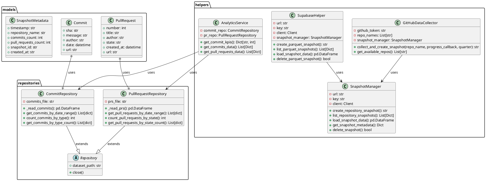
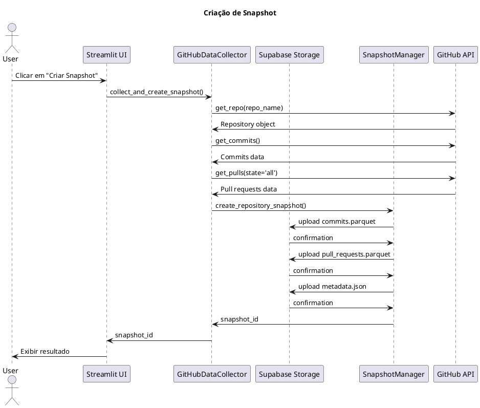
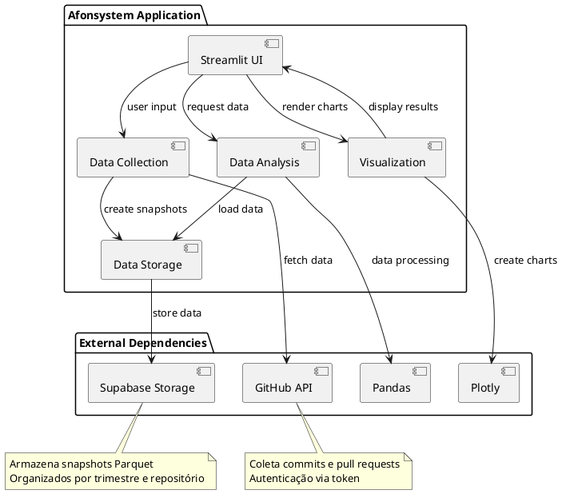

# Afonsystem - Documentação Completa

## Índice
1. [Visão Geral](#visão-geral)
2. [Estrutura do Projeto](#estrutura-do-projeto)
3. [Classes e Arquitetura](#classes-e-arquitetura)
4. [Lógica de Código](#lógica-de-código)
5. [Diagramas UML](#diagramas-uml)
6. [Táticas Arquiteturais](#táticas-arquiteturais)

## Visão Geral

O Afonsystem é uma aplicação web Streamlit desenvolvida para análise de repositórios GitHub. A aplicação coleta dados de commits e pull requests de repositórios configurados, armazena-os em snapshots Parquet no Supabase Storage e fornece uma interface web para análise e visualização desses dados.

### Tecnologias Utilizadas
- **Streamlit**: Framework web para interface
- **PyGithub**: Integração com a API do GitHub
- **Supabase**: Banco de dados e armazenamento
- **Pandas**: Manipulação de dados
- **Plotly**: Visualização de dados
- **Pydantic**: Modelagem de dados com validação
- **Parquet**: Formato de armazenamento de dados

## Estrutura do Projeto

```
afonsystem/
├── app.py                     # Arquivo principal da aplicação Streamlit
├── requirements.txt           # Dependências do projeto
├── models/                    # Modelos de dados (Pydantic)
│   ├── commit.py             # Modelo de commit
│   ├── pull_request.py       # Modelo de pull request
│   └── snapshot.py           # Modelo de snapshot
├── helpers/                   # Módulos auxiliares
│   ├── __init__.py           # Exportação de módulos
│   ├── analytics_service.py  # Serviço de análise de dados
│   ├── app_config.py         # Configuração da aplicação
│   ├── data_analysis.py      # Funções de análise de dados
│   ├── data_collector.py     # Coletor de dados do GitHub
│   ├── data_formatter.py     # Formatação de dados
│   ├── database_helper.py    # Helper para banco de dados
│   ├── snapshot_manager.py   # Gerenciador de snapshots
│   ├── supabase_helper.py    # Helper para Supabase
│   └── ui_components.py      # Componentes de interface
├── repositories/              # Repositórios de dados
│   ├── commit_repository.py  # Repositório de commits
│   └── pull_request_repository.py # Repositório de pull requests
├── docs/                     # Documentação
└── ...
```

## Classes e Arquitetura

### Modelos de Dados (Pydantic)

#### Commit
- **sha**: Hash SHA do commit
- **message**: Mensagem do commit
- **author**: Autor do commit
- **date**: Data do commit
- **url**: URL do commit no GitHub

#### PullRequest
- **number**: Número do pull request
- **title**: Título do pull request
- **author**: Autor do pull request
- **state**: Estado do pull request (open/closed)
- **created_at**: Data de criação
- **url**: URL do pull request

#### SnapshotMetadata
- **timestamp**: Timestamp do snapshot
- **repository_name**: Nome do repositório
- **commits_count**: Contagem de commits
- **pull_requests_count**: Contagem de pull requests
- **snapshot_id**: ID único do snapshot
- **created_at**: Timestamp de criação

### Classes de Serviço

#### GitHubDataCollector
Classe responsável por coletar dados do GitHub:
- Conecta-se à API do GitHub usando token
- Coleta commits e pull requests de repositórios configurados
- Cria snapshots de dados usando SnapshotManager

#### SupabaseHelper
Classe para operações de armazenamento Supabase:
- Cria e gerencia snapshots Parquet
- Carrega dados de snapshots
- Lista e deleta snapshots
- Fornece resumos de snapshots

#### SnapshotManager
Classe para gerenciamento de snapshots:
- Cria snapshots Parquet de dados
- Faz upload para Supabase Storage
- Lista e obtém metadados de snapshots
- Carrega dados de snapshots

#### AnalyticsService
Serviço para análise de dados:
- Calcula KPIs de commits
- Fornece dados para visualização
- Filtra dados por intervalo de datas

#### CommitRepository e PullRequestRepository
Repositórios para persistência de dados:
- Operações CRUD para commits e pull requests
- Filtros por data, autor, tipo
- Agrupamentos e contagens

## Lógica de Código

### Fluxo Principal
1. A aplicação Streamlit inicia e configura o ambiente virtual
2. O usuário seleciona um trimestre e repositório
3. Um snapshot pode ser criado coletando dados do GitHub
4. Dados são armazenados em formato Parquet no Supabase Storage
5. O usuário seleciona um snapshot existente para análise
6. Dados são carregados e visualizações são renderizadas

### Coleta de Dados
- A aplicação usa PyGithub para acessar a API do GitHub
- Coleta commits e pull requests de repositórios configurados
- Dados são convertidos para DataFrames pandas
- DataFrames são salvos em formato Parquet em snapshots

### Armazenamento de Dados
- Dados são salvos em formato Parquet para eficiência
- Cada snapshot contém commits.parquet, pull_requests.parquet e metadata.json
- Snapshots são organizados por trimestre e repositório
- Armazenados no Supabase Storage

### Análise de Dados
- Commits são categorizados por tipo (feat, fix, docs, etc.)
- KPIs são calculados baseados em tipos de commits
- Visualizações são geradas com Plotly (gráficos de pizza, linha e barra)
- Dados podem ser filtrados por intervalo de datas e autor

## Diagramas UML

### Diagrama de Classes



### Diagrama de Sequência - Criação de Snapshot



### Diagrama de Componentes



## Táticas Arquiteturais

### 1. Persistência de Dados
- **Tática**: Armazenamento Parquet em nuvem
- **Implementação**: Dados são salvos em formato Parquet (colunar, eficiente) no Supabase Storage
- **Benefícios**: Compactação eficiente, leitura rápida de colunas específicas, armazenamento escalável

### 2. Isolamento de Dados
- **Tática**: Snapshots independentes
- **Implementação**: Cada coleta de dados gera um snapshot separado com metadados
- **Benefícios**: Histórico de estados, recuperação fácil, dados imutáveis para análise

### 3. Cache de Dados
- **Tática**: Cache de Streamlit
- **Implementação**: @st.cache_resource e @st.cache_data para objetos e dados
- **Benefícios**: Redução de chamadas à API e Supabase, melhor performance

### 4. Separação de Responsabilidades
- **Tática**: Padrão de repositórios e serviços
- **Implementação**: Repositórios para persistência, serviços para lógica de negócio
- **Benefícios**: Testabilidade, manutenibilidade, escalabilidade

### 5. Interface de Dados Tipada
- **Tática**: Pydantic para modelagem de dados
- **Implementação**: Modelos Pydantic com validação automática
- **Benefícios**: Validação de dados, documentação automática, segurança de tipo

### 6. Escalabilidade Horizontal
- **Tática**: Arquitetura stateless
- **Implementação**: Streamlit app sem estado de sessão crítico
- **Benefícios**: Fácil horizontal scaling, menor acoplamento

### 7. Integração com APIs Externas
- **Tática**: Abstração de clientes de API
- **Implementação**: GitHubDataCollector abstrai a API do GitHub
- **Benefícios**: Fácil substituição, testabilidade, centralização de lógica

### 8. Visualização de Dados
- **Tática**: Camada de visualização separada
- **Implementação**: Componentes UI separados da lógica de dados
- **Benefícios**: Facilidade de atualização de visualizações, reutilização de componentes