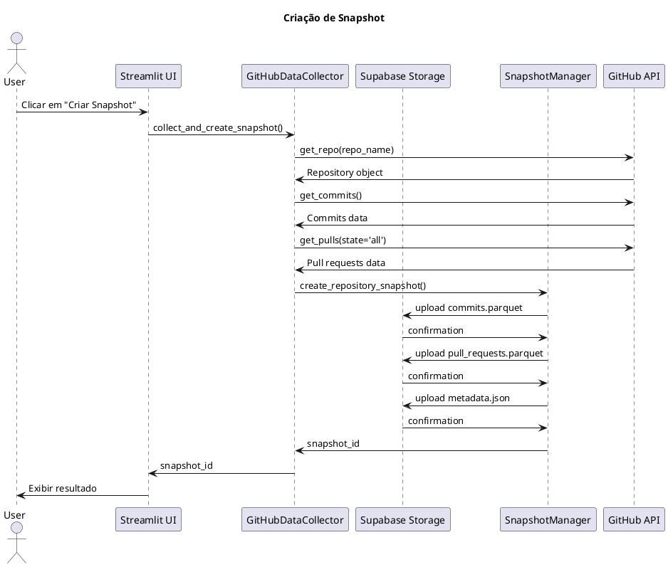

# Estudo de Caso 1 - Afonsystem

Este diretório contém os diagramas UML e documentação do estudo de caso do sistema Afonsystem.

## Diagramas UML

### 1. Diagrama de Sequência - Criação de Snapshot



Este diagrama mostra o fluxo de criação de um snapshot, desde a interação do usuário até o armazenamento dos dados no Supabase Storage.

### 2. Diagrama de Classes


Este diagrama apresenta a estrutura de classes do sistema, incluindo:
- **Models**: Commit, PullRequest, SnapshotMetadata
- **Helpers**: GitHubDataCollector, SupabaseHelper, SnapshotManager, AnalyticsService
- **Repositories**: CommitRepository, PullRequestRepository

### 3. Diagrama de Componentes


Este diagrama mostra a arquitetura de componentes do sistema Afonsystem e suas dependências externas.

## Arquivos de Diagramas

- `sequence_diagram.puml` - Código PlantUML do diagrama de sequência
- `class_diagram.puml` - Código PlantUML do diagrama de classes
- `component_diagram.puml` - Código PlantUML do diagrama de componentes

## Documentação

- `PROJECT_DOCUMENTATION.md` - Documentação completa do projeto Afonsystem

## Imagens Geradas

- `sequence_diagram.png` - Imagem PNG do diagrama de sequência
- `class_diagram.png` - Imagem PNG do diagrama de classes
- `component_diagram.png` - Imagem PNG do diagrama de componentes

## Como Usar

Para regenerar as imagens PNG a partir dos arquivos PlantUML, use:

```bash
java -jar plantuml.jar -tpng *.puml
```

## Tecnologias Utilizadas

- **PlantUML**: Para criação dos diagramas UML
- **Java**: Para execução do PlantUML
- **PNG**: Formato de saída das imagens
