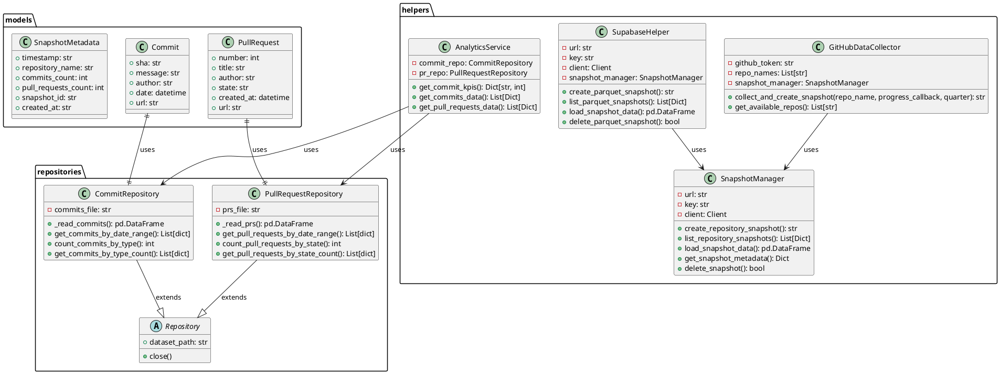
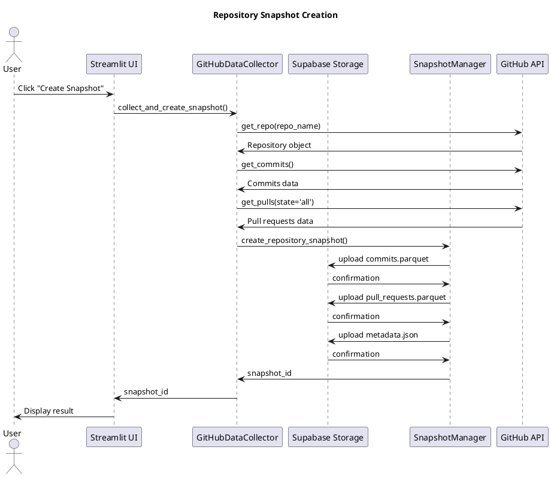
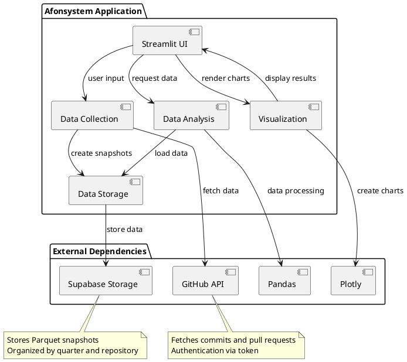

# Afonsystem - Complete Documentation

## Index
1. [Overview](#overview)
2. [Project Structure](#project-structure)
3. [Classes and Architecture](#classes-and-architecture)
4. [Code Logic](#code-logic)
5. [UML Diagrams](#uml-diagrams)
6. [Architectural Tactics](#architectural-tactics)

## Overview

Afonsystem is a Streamlit web application developed for GitHub repository analysis. The application collects data from commits and pull requests of configured repositories, stores them in Parquet snapshots in Supabase Storage, and provides a web interface for analysis and visualization of this data.

### Technologies Used
- **Streamlit**: Web framework for interface
- **PyGithub**: Integration with GitHub API
- **Supabase**: Database and storage
- **Pandas**: Data manipulation
- **Plotly**: Data visualization
- **Pydantic**: Data modeling with validation
- **Parquet**: Data storage format

## Project Structure

```
afonsystem/
├── app.py                     # Main Streamlit application file
├── requirements.txt           # Project dependencies
├── models/                    # Data models (Pydantic)
│   ├── commit.py             # Commit model
│   ├── pull_request.py       # Pull request model
│   └── snapshot.py           # Snapshot model
├── helpers/                   # Helper modules
│   ├── __init__.py           # Module exports
│   ├── analytics_service.py  # Data analytics service
│   ├── app_config.py         # Application configuration
│   ├── data_analysis.py      # Data analysis functions
│   ├── data_collector.py     # GitHub data collector
│   ├── data_formatter.py     # Data formatting
│   ├── database_helper.py    # Database helper
│   ├── snapshot_manager.py   # Snapshot manager
│   ├── supabase_helper.py    # Supabase helper
│   └── ui_components.py      # Interface components
├── repositories/              # Data repositories
│   ├── commit_repository.py  # Commit repository
│   └── pull_request_repository.py # Pull request repository
├── docs/                     # Documentation
└── ...
```

## Classes and Architecture

### Data Models (Pydantic)

#### Commit
- **sha**: Commit SHA hash
- **message**: Commit message
- **author**: Commit author
- **date**: Commit date
- **url**: Commit URL on GitHub

#### PullRequest
- **number**: Pull request number
- **title**: Pull request title
- **author**: Pull request author
- **state**: Pull request state (open/closed)
- **created_at**: Creation date
- **url**: Pull request URL

#### SnapshotMetadata
- **timestamp**: Snapshot timestamp
- **repository_name**: Repository name
- **commits_count**: Commit count
- **pull_requests_count**: Pull request count
- **snapshot_id**: Unique snapshot ID
- **created_at**: Creation timestamp

### Service Classes

#### GitHubDataCollector
Class responsible for collecting data from GitHub:
- Connects to GitHub API using token
- Collects commits and pull requests from configured repositories
- Creates data snapshots using SnapshotManager

#### SupabaseHelper
Class for Supabase storage operations:
- Creates and manages Parquet snapshots
- Loads data from snapshots
- Lists and deletes snapshots
- Provides snapshot summaries

#### SnapshotManager
Class for snapshot management:
- Creates Parquet snapshots of data
- Uploads to Supabase Storage
- Lists and retrieves snapshot metadata
- Loads data from snapshots

#### AnalyticsService
Service for data analysis:
- Calculates commit KPIs
- Provides data for visualization
- Filters data by date range

#### CommitRepository and PullRequestRepository
Data persistence repositories:
- CRUD operations for commits and pull requests
- Filters by date, author, type
- Grouping and counting

## Code Logic

### Main Flow
1. Streamlit application starts and configures virtual environment
2. User selects a quarter and repository
3. A snapshot can be created by collecting data from GitHub
4. Data is stored in Parquet format in Supabase Storage
5. User selects an existing snapshot for analysis
6. Data is loaded and visualizations are rendered

### Data Collection
- Application uses PyGithub to access GitHub API
- Collects commits and pull requests from configured repositories
- Data is converted to pandas DataFrames
- DataFrames are saved in Parquet format in snapshots

### Data Storage
- Data is stored in Parquet format for efficiency
- Each snapshot contains commits.parquet, pull_requests.parquet and metadata.json
- Snapshots are organized by quarter and repository
- Stored in Supabase Storage

### Data Analysis
- Commits are categorized by type (feat, fix, docs, etc.)
- KPIs are calculated based on commit types
- Visualizations are generated with Plotly (pie, line, and bar charts)
- Data can be filtered by date range and author

## UML Diagrams

### Class Diagram



### Sequence Diagram - Repository Snapshot Creation



### Component Diagram



## Architectural Tactics

### 1. Data Persistence
- **Tactic**: Cloud-based Parquet storage
- **Implementation**: Data is saved in Parquet format (columnar, efficient) in Supabase Storage
- **Benefits**: Efficient compression, fast reading of specific columns, scalable storage

### 2. Data Isolation
- **Tactic**: Independent snapshots
- **Implementation**: Each data collection generates a separate snapshot with metadata
- **Benefits**: Historical states, easy recovery, immutable data for analysis

### 3. Data Caching
- **Tactic**: Streamlit caching
- **Implementation**: @st.cache_resource and @st.cache_data for objects and data
- **Benefits**: Reduced API and Supabase calls, better performance

### 4. Separation of Concerns
- **Tactic**: Repository and service pattern
- **Implementation**: Repositories for persistence, services for business logic
- **Benefits**: Testability, maintainability, scalability

### 5. Typed Data Interface
- **Tactic**: Pydantic for data modeling
- **Implementation**: Pydantic models with automatic validation
- **Benefits**: Data validation, automatic documentation, type safety

### 6. Horizontal Scalability
- **Tactic**: Stateless architecture
- **Implementation**: Streamlit app without critical session state
- **Benefits**: Easy horizontal scaling, reduced coupling

### 7. External API Integration
- **Tactic**: API client abstraction
- **Implementation**: GitHubDataCollector abstracts GitHub API
- **Benefits**: Easy replacement, testability, centralized logic

### 8. Data Visualization
- **Tactic**: Separate visualization layer
- **Implementation**: UI components separated from data logic
- **Benefits**: Easy visualization updates, component reuse