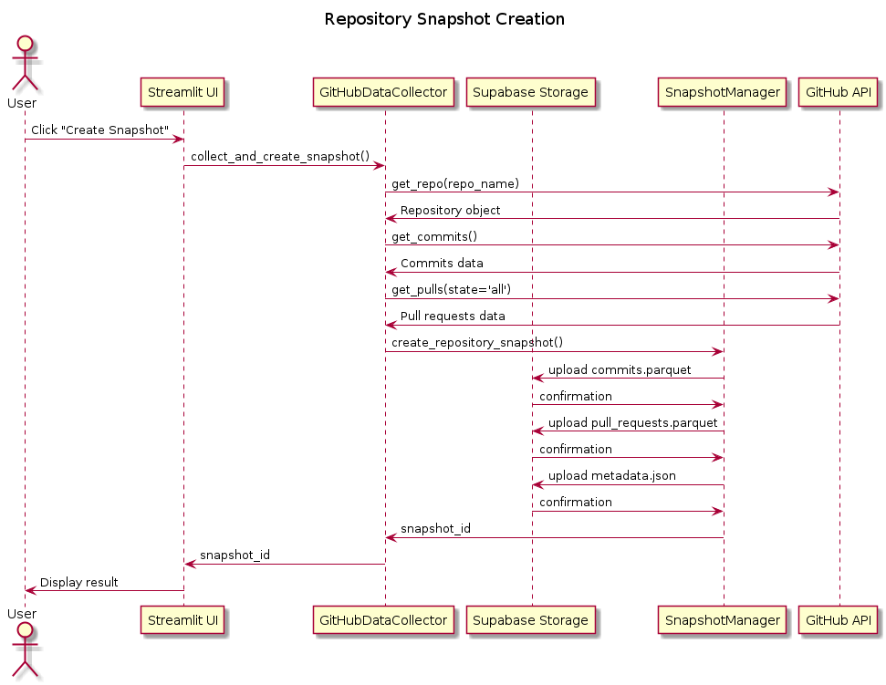
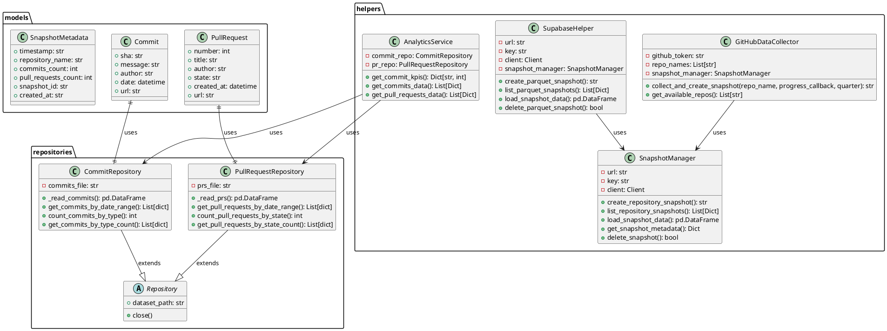
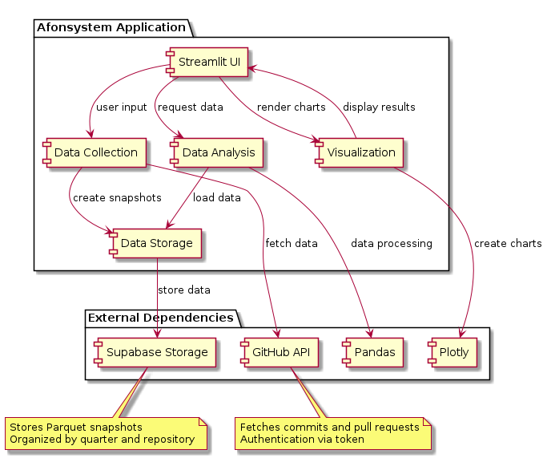

# Case Study 1 - Afonsystem

This directory contains the UML diagrams and documentation for the Afonsystem case study.

## UML Diagrams

### 1. Sequence Diagram - Snapshot Creation



This diagram shows the snapshot creation flow, from user interaction to data storage in Supabase Storage.

### 2. Class Diagram



This diagram presents the system's class structure, including:
- **Models**: Commit, PullRequest, SnapshotMetadata
- **Helpers**: GitHubDataCollector, SupabaseHelper, SnapshotManager, AnalyticsService
- **Repositories**: CommitRepository, PullRequestRepository

### 3. Component Diagram



This diagram shows the component architecture of the Afonsystem and its external dependencies.

## Diagram Files

- `sequence_diagram.puml` - PlantUML code for the sequence diagram
- `class_diagram.puml` - PlantUML code for the class diagram
- `component_diagram.puml` - PlantUML code for the component diagram

## Documentation

- `PROJECT_DOCUMENTATION.md` - Complete documentation for the Afonsystem project

## Generated Images

- `sequence_diagram.png` - PNG image of the sequence diagram
- `class_diagram.png` - PNG image of the class diagram
- `component_diagram.png` - PNG image of the component diagram

## How to Use

To regenerate the PNG images from PlantUML files, use:

```bash
java -jar plantuml.jar -tpng *.puml
```

## Technologies Used

- **PlantUML**: For creating UML diagrams
- **Java**: For running PlantUML
- **PNG**: Output format for images
